 # Git Workflow - Fashion Store FS

Ini dokumentasi proses upload project Fashion Store FS ke GitHub pakai Git.

Repo: https://github.com/fakhrianonym/assignment-01-fakhri

## 1. Persiapan Git

Cek dulu Git udah terinstall apa belum:

```bash
git --version
```

Terus set nama sama email buat identitas commit:

```bash
git config --global user.name "[nama]"
git config --global user.email "[email]"
```

## 2. Buat Repository

Bikin repo baru di GitHub namanya `assignment-01-fakhri`. Waktu bikin, opsi "Add README" sama "Add .gitignore" sengaja nggak dicentang, biar nggak bentrok pas push dari lokal nanti.

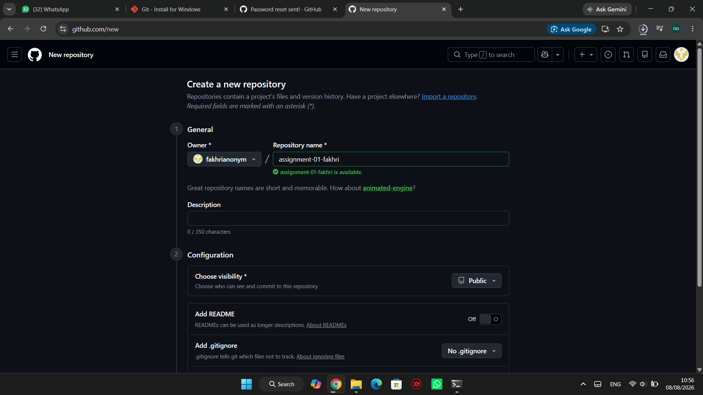

## 3. Inisialisasi Git

Masuk ke folder project, terus:

```bash
cd C:/assignment-01-fakhri
git init
```

Ini bikin folder `.git` yang nyimpen semua riwayat project.

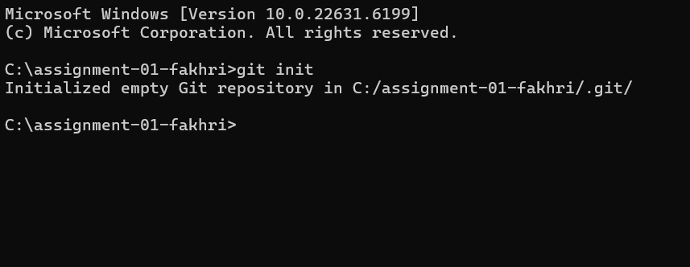

## 4. Cek Perubahan File

```bash
git status
```

Semua file (index.html, css, images) masih warna merah / "untracked" karena Git belum nyatet file-file itu.

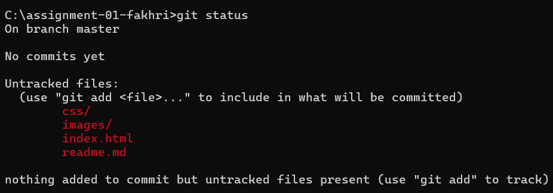

## 5. Staging

```bash
git add .
```

Titik artinya semua file dimasukin. Habis itu cek lagi pake `git status`, warnanya udah jadi hijau, siap di-commit.

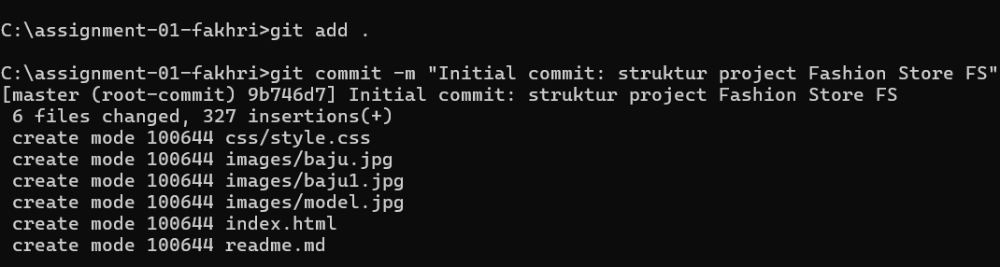

## 6. Commit

```bash
git commit -m "Initial commit: struktur project Fashion Store FS"
```

Ini nyimpen semua file yang tadi ke riwayat Git secara permanen.

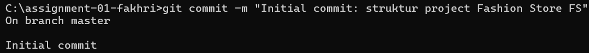

## 7. Hubungin ke Remote

```bash
git remote add origin https://github.com/fakhrianonym/assignment-01-fakhri.git
git branch -M main
git remote -v
```

`origin` itu nama alias buat URL GitHub-nya, biar nggak perlu ketik URL panjang tiap mau push.

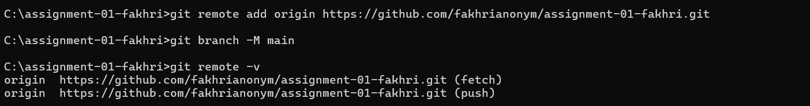

## 8. Push ke GitHub

```bash
git push -u origin main
```

Karena baru pertama push, disuruh login dulu lewat browser.

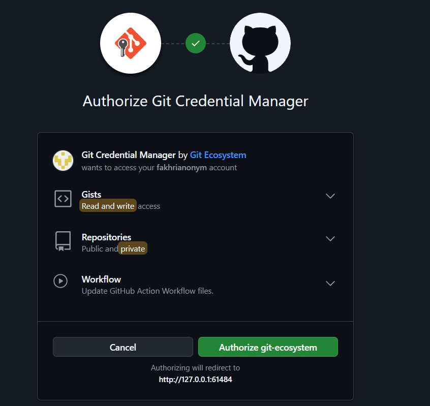

Setelah login, push-nya lanjut sampe selesai, terus file udah muncul di GitHub.

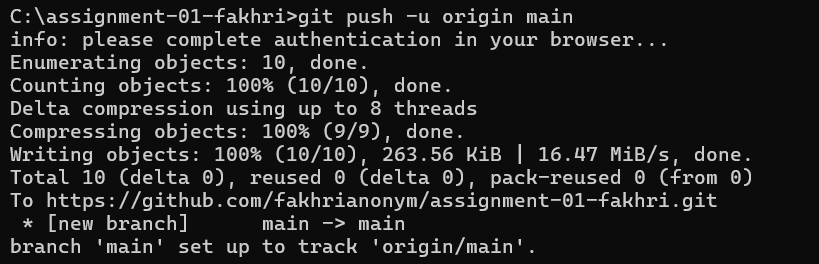
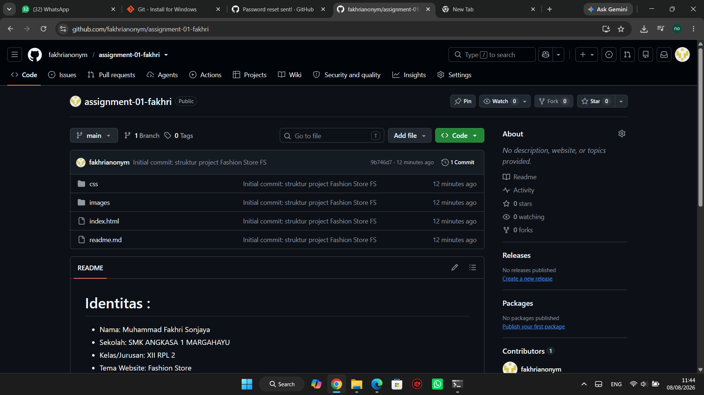

## 9. Perubahan Lanjutan

Habis commit pertama, saya coba edit-edit lagi biar ada beberapa commit, caranya diulang aja: edit file → `git add .` → `git commit` → `git push`.

Commit yang udah dibuat:
- `Add: gitignore file` - nambahin .gitignore biar file kayak Thumbs.db nggak ikut ke-upload
- `Update: tampilan section about` - ubah CSS di section about

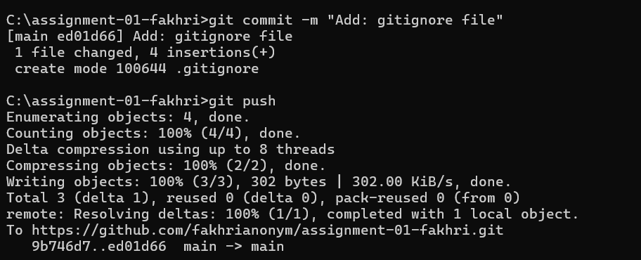
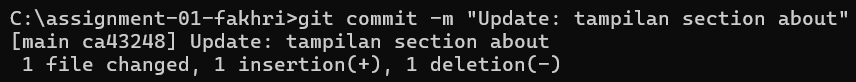

## 10. Lihat Riwayat Commit

```bash
git log --oneline
```

Ini nunjukin semua commit yang udah pernah dibuat, dari yang paling baru di atas.

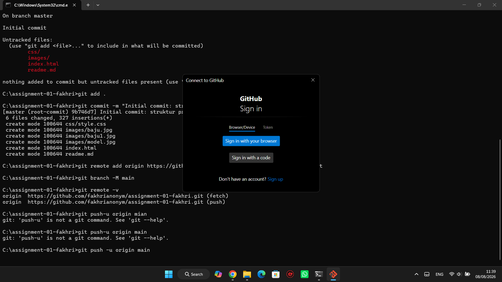

## 11. Kendala

- Sempet salah ketik `push-u` (kurang spasi), jadinya error "not a git command". Diperbaiki jadi `git push -u origin main`.
- Sempet commit tapi hasilnya "nothing to commit" karena lupa nyimpen (save) file dulu sebelum di-add.
- Bingung `mkdir` di Windows harus pake `\` bukan `/` buat folder bertingkat.

## 12. Kesimpulan

Dari tugas ini saya jadi paham alur Git itu: edit file → `add` (masuk staging) → `commit` (kesimpen permanen di lokal) → `push` (dikirim ke GitHub). Nggak bisa langsung commit tanpa add dulu, dan kalo file belum di-save Git nggak bakal ngedeteksi ada perubahan.

Commit message juga penting biar keliatan perubahan apa aja yang udah dilakuin, jadi nggak cuma 1 commit gede doang. `.gitignore` juga berguna biar file yang nggak penting (kayak file sampah sistem) nggak ikut ke-upload ke GitHub.

Bukti project udah lengkap tersedia di GitHub:

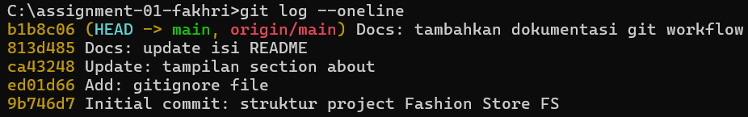
